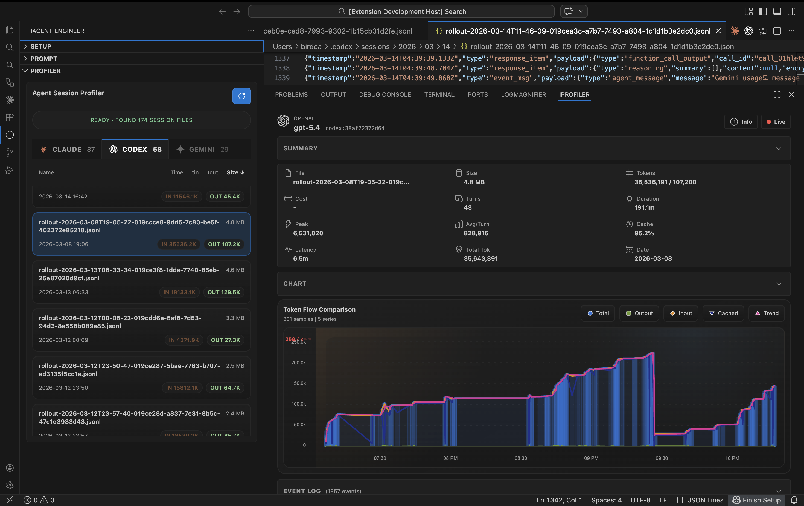

# iAgent Engineer

iAgent Engineer is a VS Code extension for moving from Figma context to generated UI code, previews, and agent-session analysis without leaving the editor.



Demo video: [YouTube quick guide](https://www.youtube.com/watch?v=YmeUWzeAsxw)

## Release Highlights

### v0.7.1

- Refreshed the repository docs so the current `0.7.x` implementation, supported workflows, and known limitations are documented consistently.
- Clarified the supported Figma path as local MCP, while remote Figma remains a disabled prototype in the current UI.
- Expanded the profiler guides to match the current sidebar scan flow and the bottom-panel `iProfiler` detail experience.

## Current Product Scope

- Local Figma MCP connection and design-data retrieval
- Multi-provider UI generation with streaming output
- Generated-result handoff to the editor, Preview Panel, or browser preview
- Agent Session Profiler for Claude and Codex logs, with a detailed `iProfiler` panel
- English and Korean UI strings

## What Ships Today

### Setup View

The `Setup` sidebar combines Figma connection tools and AI provider settings.

- Connect to a local MCP endpoint
- Paste a Figma URL or JSON payload
- Fetch design context, metadata, variable definitions, screenshots, and source-data assets
- Open fetched payloads directly in the editor
- Save API keys and preferred models for `Gemini`, `Claude`, `DeepSeek`, `Qwen`, and `OpenRouter`
- Open provider API-key pages and inspect model metadata

### Prompt View

The `Prompt` sidebar is the generation workspace.

- Choose whether to include design context or metadata
- Optionally include the latest fetched screenshot
- Generate `tsx`, `html`, `vue`, or `tailwind`
- See prompt-size estimates and selected-model token limits
- Stream output with progress and cancel support
- Reopen the latest generated file, Preview Panel, or browser preview

### Profiler View

The `Profiler` sidebar scans supported agent session files and opens details in the bottom panel.

- Scan local Claude and Codex session stores
- Sort sessions by name, time, input tokens, output tokens, or file size
- Select a session to open the detailed `iProfiler` panel
- Start live monitoring for likely-active session files
- Jump from chart points or raw events back to the source log line

### Output Channel

There is no separate Log webview in the current build. Extension logs are written to the `iAgent Engineer` output channel, and the extension contributes commands to clear or copy that log.

## Current Limitations

- `remote` Figma mode is scaffolded in the codebase, but actual remote auth/fetch/screenshot flows are currently disabled in the extension UI. Use `local` MCP mode for working Figma retrieval.
- The profiler service contains Gemini parsing support internally, but the Gemini tab is intentionally disabled in the current sidebar UI.
- The profiler archive flow exists host-side, but there is no archive button in the current webview.
- Browser preview falls back to the Preview Panel when packaged runtime dependencies are unavailable.

## Requirements

- VS Code `1.85+`
- Node.js `20+` for local development
- A reachable local Figma MCP endpoint for Figma data features
- At least one provider API key if you want to generate code
  - [Google AI Studio](https://aistudio.google.com/app/apikey)
  - [Anthropic Console](https://console.anthropic.com/settings/keys)
  - [DeepSeek Platform](https://platform.deepseek.com/api_keys)
  - [DashScope Console](https://dashscope.console.aliyun.com/apiKey)
  - [OpenRouter Keys](https://openrouter.ai/keys)

## Quick Start

1. Install the extension and open **iAgent Engineer** from the activity bar.
2. In `Setup`, leave the connection mode on `local` and connect to your MCP endpoint.
3. Paste a Figma URL or MCP JSON and fetch design context, metadata, variables, screenshots, or source data.
4. In the same view, choose your agent, save an API key, and load models.
5. Open `Prompt`, pick an output format, and generate code.
6. Open the latest result in the editor, Preview Panel, or browser preview.
7. Open `Profiler` when you want to inspect local Claude or Codex session logs in `iProfiler`.

## Key Settings

Common settings live under the `iagent-engineer.*` namespace.

- `iagent-engineer.defaultAgent`
- `iagent-engineer.defaultModel`
- `iagent-engineer.mcpConnectionMode`
- `iagent-engineer.mcpEndpoint`
- `iagent-engineer.remoteMcpEndpoint`
- `iagent-engineer.remoteMcpAuthUrl`
- `iagent-engineer.openFetchedDataInEditor`
- `iagent-engineer.claudeModels`
- `iagent-engineer.deepseekModels`
- `iagent-engineer.qwenModels`
- `iagent-engineer.openrouterModels`
- `iagent-engineer.profiler.*`

## Development

```bash
npm ci
npm run verify
```

Useful scripts:

- `npm run build`
- `npm run watch`
- `npm run lint`
- `npm run test:unit`
- `npm run test:e2e`
- `npm run verify`
- `npm run verify:coverage`
- `npm run package`

The bundled `workers/` project contains the Cloudflare Worker used for the remote Figma prototype. It is still in the repository, but the extension's remote Figma workflow is not currently exposed as a supported end-to-end feature.

## Additional Docs

- [Contributing guide](CONTRIBUTING.md)
- [Security policy](SECURITY.md)
- [Release checklist](docs/release-checklist.md)
- [Profiler screen guide](docs/info-profiler.md)
- [iProfiler summary data guide](docs/iprofiler-summary-data.md)
- [iProfiler key event guide](docs/iprofiler-key-events-data.md)

## Repository

- Issues: https://github.com/birdea/vscode-iagent-engineer/issues
- Homepage: https://github.com/birdea/vscode-iagent-engineer#readme
